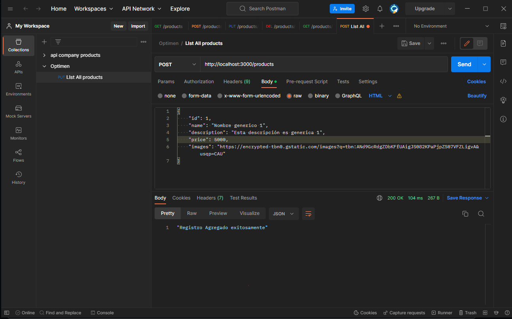
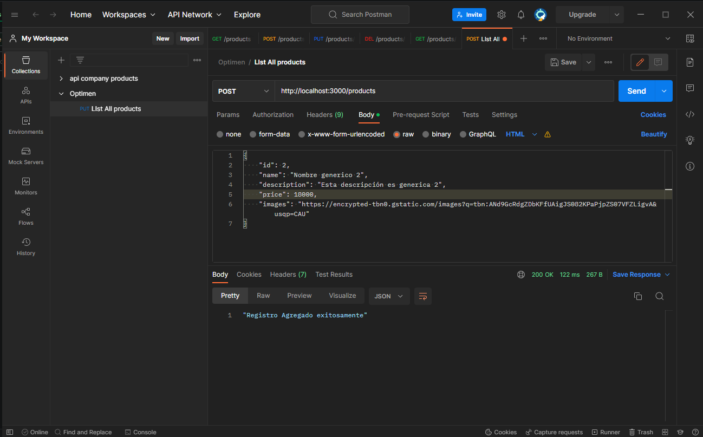
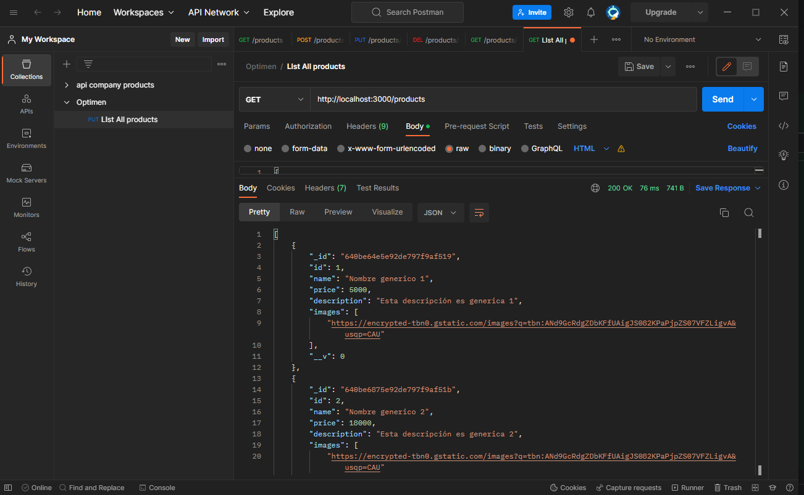
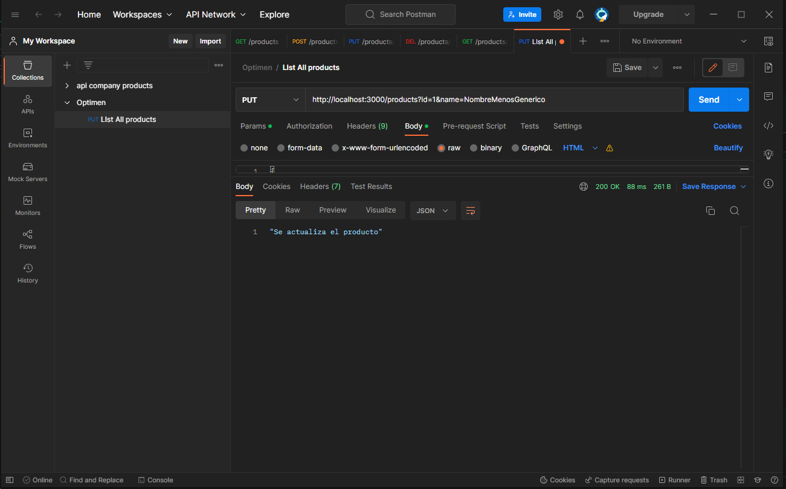
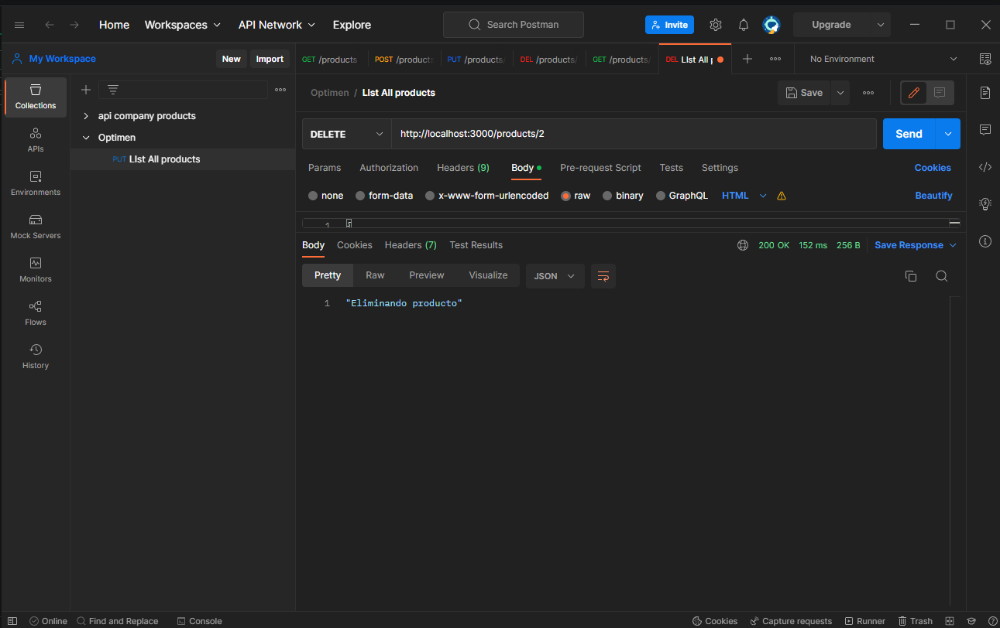
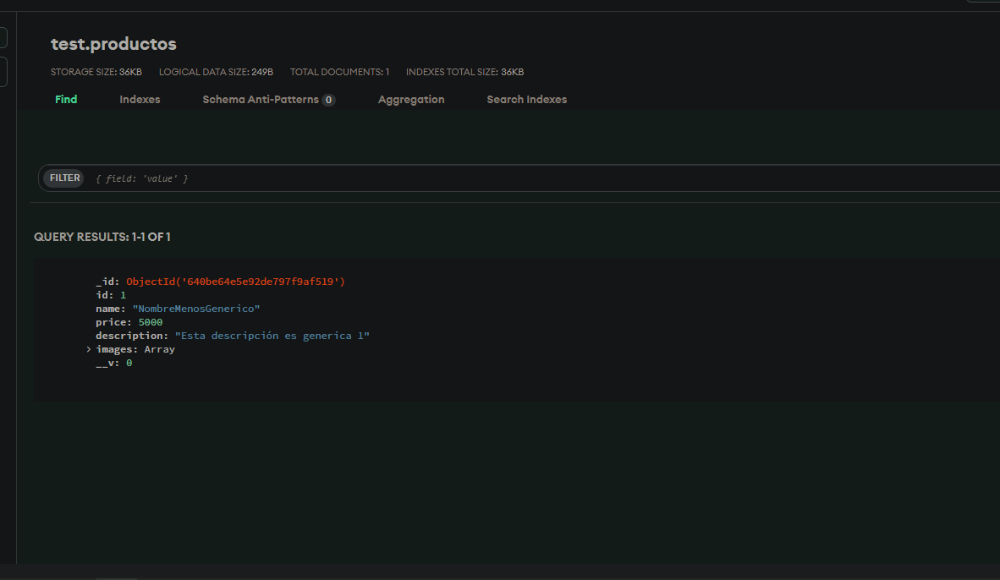

## Instalar dependencias

### `npm i`

## Ejecutar proyecto

### `npm start`

# Funcionalidad

El proyecto consta de un CRUD de backend para una colección de mongodb llamada product, para utilizarla se realizan peticiones atravez de postman con las funciones: GET, POST, PUT, DELETE. 

# Postman

## POST
<picture>
  
</picture>

<picture>
  
</picture>

## GET

<picture>
  
</picture>

## PUT

<picture>
  
</picture>

<picture>
  
</picture>

## DELETE

<picture>
  
</picture>

## DATABASE

<picture>
  
</picture>
